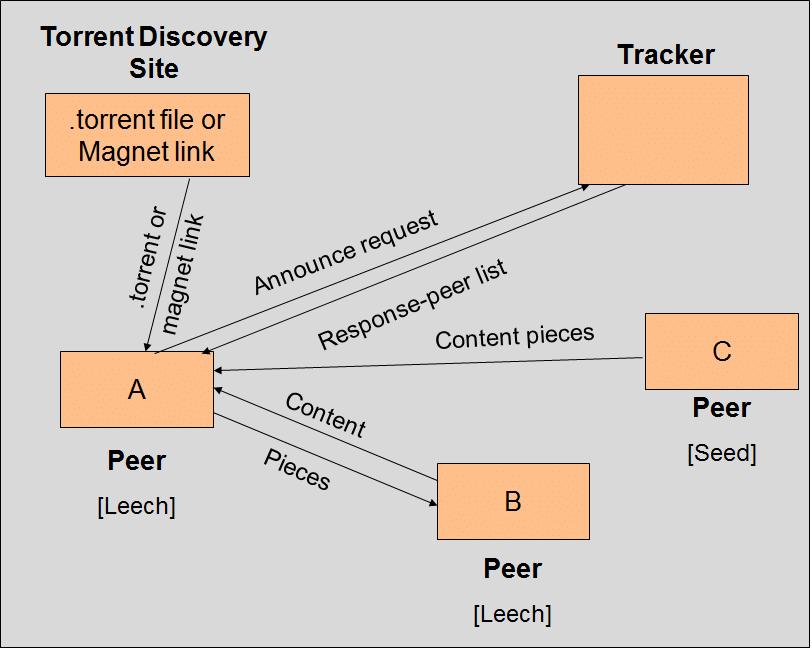

## What torrent file holds
The .torrent file holds all critical meta yet static information about the content, like

Docs: https://www.bittorrent.org/index.html


---
BitTorrent Flow

- [X] **Find Peers**
  - [X] Open .torrent file (Parsing file)
  - [X] Peers from the Tracker (Tracker received in .torrent file)
  - [X] Parse Response of the Tracker
- [] **Download from the Peers**
  - [X] TCP Connection
  - [X] Complete the Handshake
  - [X] Send and receive messages
    - [X] Interpreting messages
    - [X] Bitfields 
  - [] Join all together
    - [] Managing concurrency: channels as queues
    - [] Managing state


`announce` - holds the URL of the tracker

`created by` - name and version of the program who created it

`creation date` - time at which the torrent was created

`encoding` - encoding of the strings in info dictionary

`comment` - some additional comments

`info` - a dictionary that describes files in the torrent

The info dictionary holds the information about the file that is being shared through the torrent. If the torrent is about the Ubuntu image, it will hold info like name, length, and md5sum of the actual file.

Given that the file is split into equal-length pieces, the info dictionary also holds

`pieces` - SHA1 of every piece of the file concatenated

piece length - number of bytes in each piece

```
 d
  8:announce
    41:http://bttracker.debian.org:6969/announce
  7:comment
    35:"Debian CD from cdimage.debian.org"
  13:creation date
    i1573903810e
  4:info
    d
      6:length
        i351272960e
      4:name
        31:debian-10.2.0-amd64-netinst.iso
      12:piece length
        i262144e
      6:pieces
        26800:�����PS�^�� (binary blob of the hashes of each piece)
    e
e
---
```